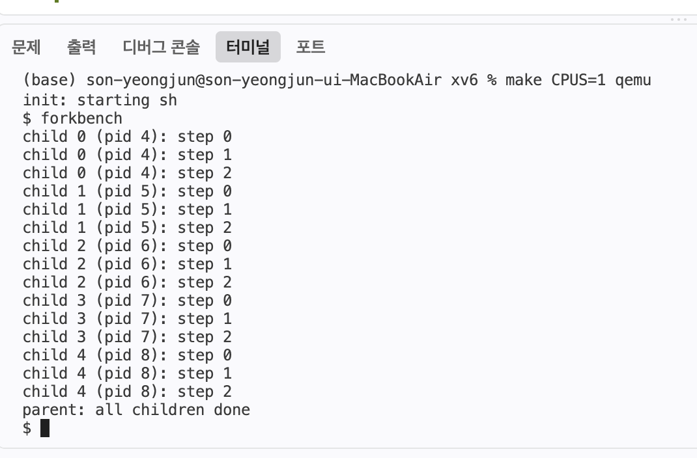
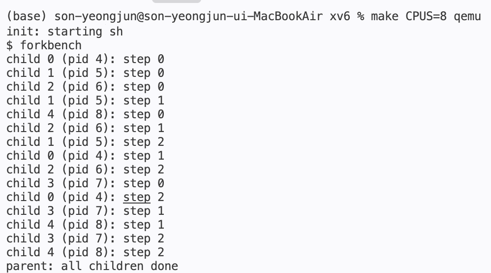

# Lab 1 — User Programs

| | |
|---|---|
| **학번** | 2022011794 |
| **이름** | 손영준 |
| **학과** | 소프트웨어공학과 |
| **브랜치** | `lab1-userprog` |

---

## 1.1 의 답 6개

### 1. `kernel/*.c` 는 몇 줄입니까?

```
(base) son-yeongjun@son-yeongjun-ui-MacBookAir xv6 % wc -l kernel/*.h | tail -1
    1105 total
(base) son-yeongjun@son-yeongjun-ui-MacBookAir xv6 % wc -l kernel/*.c | tail -1
    5218 total
```

.c 파일 5218줄 + .h 파일 1105줄 = 총 6323줄

---

### 2. `user/*.c` 는 몇 개입니까?

```
(base) son-yeongjun@son-yeongjun-ui-MacBookAir xv6 % ls user/*.c | wc -l
      26
```

26 개

---

### 3. `echo.c` 에서 `exit(0)` 을 지우면 무슨 일이 벌어질까요? (예상만)

exit(0)은 프로그램을 정상적으로 종료했다는 의미이다 하지만 이것을 지우게 된다면 정상적인 프로세스 종료가 보장되지 않고 문제가 발생할 수 있다

---

### 4. `echo.c` 에 `printf` 가 없는데도 화면에 글자가 나옵니다. 어떻게 그럴까요?

printf()는 화면에 글자를 출력하기 위한 사용자 프로그램 함수이다 user/printf.c 파일에 printf 함수가 구현되어 있다 xv6에서는 printf()가 아니라 write()를 사용한다 사용자가 printf()를 사용하면 문자열을 분석하여 write()가 커널로 전달하고 화면에 띄우는 구조이다

---

### 5. `printf` 는 시스템콜입니까? 아니라면 무엇입니까?

아니다, 사용자가 편하게 글자를 출력하기 위한 함수이다

---

### 6. 모든 프로그램이 `printf` 코드를 각자 품고 있습니다. 무엇이 낭비되고, 대신 무엇이 단순해집니까?

printf 코드가 프로그램마다 중복되기 때문에 메모리 공간이 낭비된다 하지만 공유 라이브러리 같은 복잡한 기능이 필요없어지기 때문에 구조가 단순해진다

---

## `user/hello.c` · `user/forkbench.c` · `user/filetest.c` 출력값

### 1. `user/hello.c`

```
(base) son-yeongjun@son-yeongjun-ui-MacBookAir xv6 % make qemu
qemu-system-riscv64 -machine virt -bios none -kernel kernel/kernel -m 128M -smp 3 -nographic -global virtio-mmio.force-legacy=false -drive file=fs.img,if=none,format=raw,id=x0 -device virtio-blk-device,drive=x0,bus=virtio-mmio-bus.0

xv6 kernel is booting

hart 2 starting
hart 1 starting
init: starting sh
$ hello
hello, xv6!
argc = 1
  argv[0] = hello
```

### 2. `user/forkbench.c`

```
$ forkbench
child 0 (pid 4): step 0
child 0 (pid 4): step 1
child 0 (pid 4): step 2
child 1 (pid 5): step 0
child 1 (pid 5): step 1
child 2 (pid 6): step 0
child 1 (pid 5): step 2
child 2 (pid 6): step 1
child 3 (pid 7): step 0
child 4 (pid 8): step 0
child 4 (pid 8): step 1
child 2 (pid 6): step 2
child 3 (pid 7): step 1
child 4 (pid 8): step 2
child 3 (pid 7): step 2
parent: all children done
```

### 3. `user/filetest.c`

```
$ filetest
write fd = 3
wrote 10 bytes
read  fd = 3
read 10 bytes: hello xv6
size = 10 bytes, inode = 27
```

---

## `forkbench` 를 CPUS=1 과 CPUS=8 로 실행한 출력

### 1. `make CPUS=1 qemu`



### 2. `make CPUS=8 qemu`



---

## 1.3 과 1.4 의 확인 질문에 대한 답

### 1.3

**자식들의 출력 순서가 매번 다릅니다. 무엇이 그 순서를 정하고 있습니까?**

cpu의 스케줄러가 순서를 정하고 있다

**`fork()` 가 부모에게는 자식의 pid 를, 자식에게는 0 을 돌려줍니다. 왜 굳이 다른 값을 줄까요?**

자식을 식별, 판단하고 wait()같은 작업을 활용하기 위해서이다

**변수 `i` 는 자식마다 값이 다릅니다. 자식이 부모의 `i` 를 "보고 있는" 것입니까, "복사해 간" 것입니까? 어떻게 확인할 수 있을까요?**

fork()는 부모 프로세스 메모리에서 자식 프로세스의 주소 공간을 복사하여 만들기 때문에 복사해 간 것이고, 부모와 자식에서 i를 각각 출력해보면 확인할 수 있다

**`wait(0)` 를 지웠을 때 자식들은 어떻게 되었습니까? 누가 그들을 거두었을까요?**

wait()은 부모가 자식 프로세스의 종료를 기다리고 종료된 자식을 회수하는 역할이기 때문에 wait()을 지운다면 부모가 자식보다 먼저 종료하는 상황이 발생할 수 있다 xv6에서는 이런 경우 init 프로세스가 거두게 된다

---

### 1.4

**③번에서 왜 또 3 이 나옵니까? `close(fd)` 를 빼면 무엇이 나옵니까?**

0은 stdin, 1은 stdout, 2는 stderr으로 3이 빈자리이기 때문에 3에 my data.txt가 할당 받고 close(fd)로 fd 3을 반납했기 때문에 open()이 가장 작은 빈 fd인 3을 다시 할당 받은 것이고 close(fd)를 빼면 3은 사용 중이기 때문에 4 가 나온다

**`write` 의 세 번째 인자를 10 대신 5 로 바꾸면 파일에 무엇이 들어갑니까?**

write(fd, "hello xv6\n", 10); 에서 세번째 인자 10은 몇 바이트를 쓸 것인가를 의미한다 따라서 세번째 인자에 10이 아닌 5를 입력한다면 5바이트만 파일에 기록하게 되고 h(1) e(2) l(3) l(4) o(5) = hello만 파일에 들어가게 된다

**`O_CREATE` 없이 존재하지 않는 파일을 열면 fd 가 몇입니까? 그 값의 의미는?**

O_CREATE 라는 의미는 파일이 없으면 새로 만든다 혹은 이미 있으면 기존 파일을 연다는 의미인데 O_CREATE 없이 존재하지 않는 파일을 열면 open()이 실패되기 때문에 -1을 반환하게 된다 여기서 -1은 유효한 fd 값이 아니라 오류를 의미한다

**프로그램을 두 번 실행하면 파일 내용이 어떻게 됩니까? 이어 붙습니까, 덮어씁니까? 짧은 내용으로 바꿔 다시 실험해 보세요.**

똑같이 10바이트로 유지된다 만약 이어 붙이기나 덮어쓰기를 원한다면 O_TRUNC, O_APPEND를 사용하면 된다
